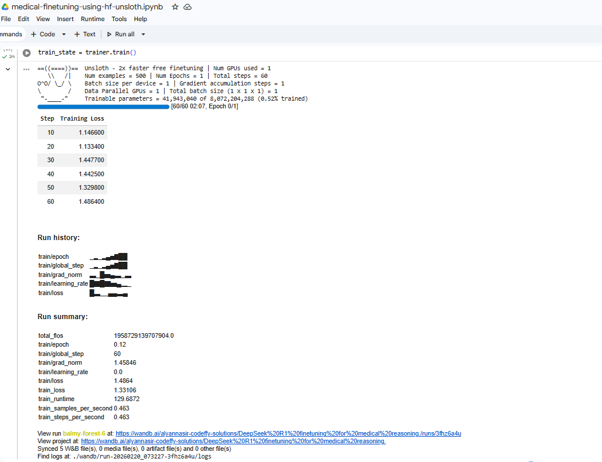
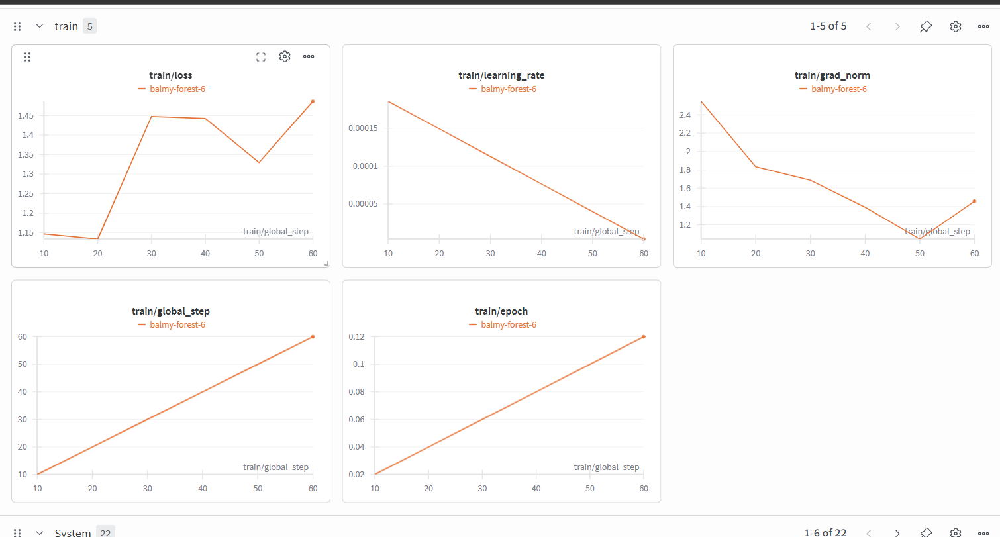

# Fine-tuning DeepSeek R1 with Unsloth

This repository contains notebook to fine-tune **DeepSeek R1 8B** model using **Unsloth**. Unsloth allows for faster and more memory-efficient fine-tuning of LLMs.

## Training Run Screenshots

### Colab QLoRA Training Run


### Weights & Biases QLoRA Training Run


## Contents

The `notebooks/` directory contains the following workflows:

- **`medical_finetuning_using_hf_unsloth.ipynb`**: Focuses on QLoRA (Quantized LoRA) techniques in 4-bit quantization for efficient fine-tuning.

## Requirements

- Python 3.10+
- CUDA-enabled GPU (recommended for Unsloth)

## Quick Setup

1. **Install Jupyter VS Code extension** (if not installed):
2. **Launch Jupyter Lab or Notebook**:
   ```bash
      jupyter lab
   ```
3. Open one of the notebooks in the `notebooks/` directory and follow the steps.
- **Prepare Secrets for notebook**:
-   `HF_TOKEN` – Required for HuggingFace login.
-   `WANDB_TOKEN` – Required for Weights & Biases (W&B) logging. Optional if you do not want training charts.

- **Execute all runs and wait until training is complete**:

## Contributing

Contributions welcome — open an issue or submit a PR.

## License

See the [LICENSE](LICENSE) file for details.
